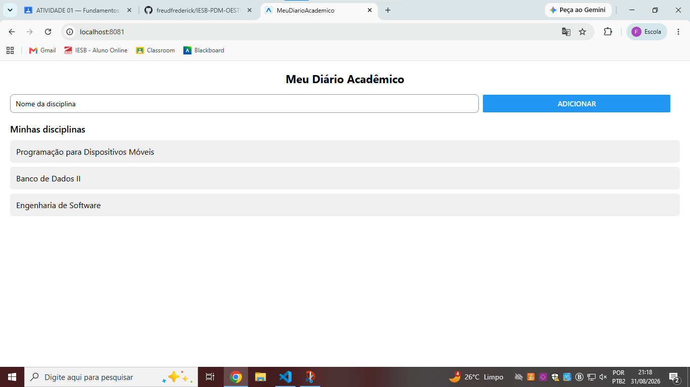

# Meu Diário Acadêmico

App desenvolvido para a Atividade 01 (Fundamentos de UI, Componentes e Layout) da disciplina Programação para Dispositivos Móveis — IESB.

## Comando usado para criar o projeto

npx create-expo-app@latest MeuDiarioAcademico --template blank

## Como rodar

npx expo start --web

## O que foi implementado

- labels.js com rótulos exportados e importados em App.js
- SafeAreaView (react-native-safe-area-context) envolvendo a tela
- Layout em flexbox: linha (row) para input + botão, coluna (column) para a lista
- StyleSheet.create organizado por bloco, com uso de largura percentual (70%) e flex (flex: 1)
- Lista estática de disciplinas renderizada com .map()

## Print da tela

